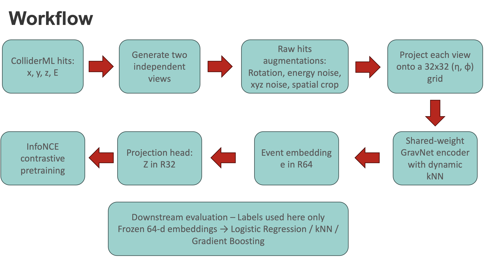
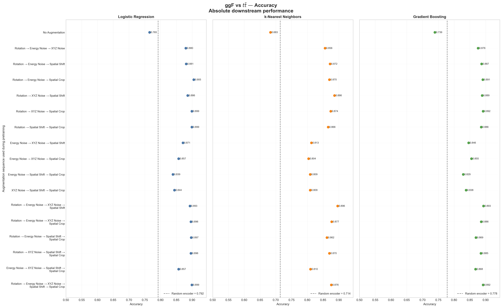

# Learning What Matters in Calorimeter Events

**Kunhe Li**  
University of Wisconsin–Madison

*An exploration of physics-informed self-supervised learning for calorimeter events.*

[Read the published version on Medium](https://medium.com/@relativity1647/learning-what-matters-in-calorimeter-events-036d38b8ad39)

---

## From Calorimeter Hits to Collision Physics

A particle collision cannot be replayed. Once it happens, physicists have to work backward from the signals left in the detector: how much of the original interaction can still be inferred from those measurements?

This summer, I studied that question using calorimeter data and self-supervised machine learning. When protons collide at high energies, their constituent particles can undergo a hard interaction that produces energetic particles, which then decay, radiate, and interact with the detector material. By the time the event reaches the calorimeter, the original collision is no longer directly visible. What remains is a sparse collection of energy deposits, or hits, distributed across the detector.

Physicists would like to use these low-level measurements to understand the structure of the collision and distinguish between different underlying processes. This is difficult because even events produced by the same process can look different: particle showers fluctuate, detector measurements are imperfect, and the entire event may appear at a different orientation without representing different physics. At the same time, genuinely different processes can produce superficially similar detector signatures.

These features make the problem well suited to self-supervised contrastive learning. Instead of requiring a physics label for every event, a model can learn by comparing two physically perturbed views of the same collision, preserving information associated with the underlying event while becoming less sensitive to variations that should not determine its identity.

A graph neural network is also a natural choice because calorimeter measurements form a sparse and irregular spatial pattern whose meaning depends on relationships among nearby energy deposits. My project combined these ideas to study how physically motivated data augmentations shape the event-level representations learned from calorimeter data.

## Learning an Event Representation Without Labels

I began with a self-supervised framework developed by my graduate mentor Aneek Jana and adapted it into a controlled study of calorimeter augmentations. Each event started as a collection of hits containing three-dimensional positions and deposited energies. The same augmentation sequence and parameter scales were used to construct two views of the event, but the actual rotation angles, energy fluctuations, coordinate shifts, and crop locations were sampled independently.

The resulting hits were projected onto a $32 \times 32$ grid in pseudorapidity $\eta$ and azimuthal angle $\phi$, two coordinates commonly used to describe directions in collider detectors. Nonempty cells became graph nodes, and a graph neural network used dynamic $k$-nearest-neighbor connections to decide which cells should exchange information. Because these neighborhoods were formed in a learned coordinate space, the network was not restricted to a fixed geometric graph.

Information from the graph was then pooled into a 64-dimensional event embedding that summarized the collision as a whole. During pretraining, a 32-dimensional projection head mapped this embedding into the space where the InfoNCE loss was evaluated. InfoNCE pulled the two views of the same event together while separating them from views of other events in the batch.

The projection head was used only for this contrastive objective; the downstream analysis used the 64-dimensional event embedding produced by the encoder.

*Figure 1. The pairwise self-supervised workflow. Two independently augmented views of the same calorimeter event are projected into $\eta$–$\phi$ graphs, encoded into event-level representations, and compared through the InfoNCE objective.*

## Choosing Which Changes Should Not Matter

This framework makes augmentation design a physics question: which changes should the model learn to ignore, and which structures should it preserve?

I studied five transformations.

A global rotation in the transverse plane, sampled uniformly between $-\pi/8$ and $\pi/8$, represented the fact that the physical identity of an event should not depend strongly on its absolute azimuthal orientation.

Independent Gaussian energy noise with

$$
\sigma_E = 10^{-4}\ \mathrm{GeV}
$$

tested robustness to small readout-scale fluctuations. This value was chosen to be comparable in order of magnitude to the quoted energy-resolution scales of the calorimeter cells.

Gaussian coordinate noise with a width of $5\ \mathrm{mm}$ introduced local spatial jitter, while a $2\ \mathrm{mm}$ event-wide transverse shift tested sensitivity to a common coordinate displacement. These geometric scales were chosen relative to the effective granularity of the coarsened representation rather than treated as exact simulations of detector resolution.

Finally, a random spatial crop set the energies in a local three-dimensional region to zero, providing a stronger test of whether the model could recognize an event when part of its local shower pattern was unavailable. This crop parameter controlled the size of the masked region relative to the spatial spread of the event; it did not mean that exactly half of the hits or energy were removed.

The order of these operations was also deliberate. Augmentations were applied to the raw hits before the $\eta$–$\phi$ projection, and the spatial crop was placed after energy noise so that masked hits could not regain energy through a later fluctuation. Negative energies produced by Gaussian noise were clipped to zero.

After projection, hit energies belonging to the same cell were summed and transformed as

$$
\log\left(E_{\mathrm{cell}}+\epsilon\right).
$$

Applying the noise in linear energy units before taking the logarithm preserves its intended physical scale, while the logarithm compresses the large dynamic range of calorimeter energies.

The derived input features were then standardized using means and standard deviations estimated from the training data and reused for validation and testing. This normalization keeps features with different units and numerical ranges from dominating the optimization simply because of their scale.

## A Controlled Pairwise Study

With the representation pipeline fixed, I tested it on three pairwise process combinations:

- gluon-fusion single-Higgs production versus top–antitop production;
- gluon-fusion Higgs production versus di-Higgs production;
- top–antitop production versus di-Higgs production.

Each comparison contained 2,500 events from each process, giving 5,000 events per pair. The process identities determined which events entered a study, but the labels themselves were not given to the contrastive loss.

Using pairwise samples made it possible to ask a more controlled question: does the usefulness of an augmentation depend on which two physical processes must eventually be distinguished?

For each process pair, I trained:

- all ten three-augmentation combinations;
- all five four-augmentation combinations;
- the complete five-augmentation sequence;
- a no-augmentation control.

This produced 17 pretrained encoders per pair and 51 in total.

All runs used the same architecture and optimization settings:

| Parameter | Value |
|---|---:|
| Training epochs | 18 |
| Batch size | 32 |
| Learning rate | $3 \times 10^{-4}$ |
| Weight decay | $10^{-4}$ |
| InfoNCE temperature | 0.07 |
| Graph neighbors | 8 |
| Event embedding dimension | 64 |
| Projection dimension | 32 |
| Random seed | 42 |

These values were inherited from the established base workflow and held fixed so that augmentation choice remained the main experimental variable.

After pretraining, I froze each encoder and extracted its 64-dimensional event embeddings. Three downstream classifiers then examined complementary properties of the representation:

- **Logistic regression** measured whether the two processes were linearly separable.
- **$k$-nearest neighbors** tested whether events from the same process formed local neighborhoods.
- **Gradient boosting** tested whether the processes could be separated by more flexible nonlinear rules.

I also evaluated a randomly initialized encoder. The random encoder and the no-augmentation encoder are best understood as two complementary controls rather than competing definitions of a single baseline. The first measures what is available before self-supervised training, while the second measures what contrastive training learns when it receives no nontrivial view transformations.

The implementation, experiment configurations, and evaluation code are available throughout this repository.

## What the Embeddings Learned

The clearest performance appeared in the gluon-fusion versus top–antitop task. With a random encoder, logistic regression, $k$-nearest neighbors, and gradient boosting reached accuracies of 0.792, 0.714, and 0.778, respectively.

Every encoder pretrained with a nontrivial augmentation combination exceeded 0.80 on this process pair. The best result was an accuracy of **0.905** from logistic regression using an encoder pretrained with:

> Rotation → Energy Noise → Spatial Crop

This is especially informative because logistic regression has a simple linear decision boundary. The result suggests that contrastive pretraining organized the 64-dimensional embeddings so that the two processes became close to linearly separable.

By comparison, the no-augmentation model achieved an accuracy of 0.765 with logistic regression, showing that a low contrastive training loss by itself does not guarantee a useful physical representation. Meaningful view variation was essential.

*Figure 2. Downstream accuracy for the gluon-fusion versus top–antitop task. Each row represents the augmentation sequence used during self-supervised pretraining, while the dashed line marks the performance of a random encoder.*

The two process pairs involving di-Higgs events were more difficult, with most augmented models reaching accuracies in the 0.7–0.8 range. However, the relative pattern across augmentation combinations was similar. Many of the highest-performing combinations contained rotation, while combinations without rotation tended to form the lower parts of the curves.

The apparent “wave” in the plots should therefore not be interpreted as a periodic phenomenon. It mainly reflects the order in which different combinations were displayed and the repeated contrast between rotation-containing and rotation-free groups.

Spatial crop was also part of the best logistic-regression configuration for gluon fusion versus top–antitop, but the current sweep does not isolate its individual contribution because it did not include every single-augmentation and two-augmentation control.

Nothing in the model architecture intentionally favors the gluon-fusion versus top–antitop pair: all three pairs used the same event counts, model structure, and training settings. The higher accuracy more likely indicates that those two processes are easier to separate in the selected ColliderML samples, although establishing the precise physical reason would require further event-level diagnostics.

## Where This Could Go Next

These results suggest that physically motivated augmentations can improve what a self-supervised model learns from calorimeter events, but they also show that different transformations should not automatically be treated as equivalent.

Rotation encodes an approximate collider symmetry, energy and coordinate noise represent small measurement perturbations, and spatial crop deliberately removes part of the recorded structure. In the current model, all transformations are introduced at the same stage, optimized through the same isotropic InfoNCE similarity, and compressed into one shared embedding space.

One possible extension is an anisotropic contrastive objective such as AnInfoNCE, in which a learnable quadratic form allows different latent directions to contribute differently to similarity. Schematically, the similarity between two representations could depend on

$$
\left(\mathbf{z}_i-\mathbf{z}_j\right)^{\mathrm T}
\mathbf{\Lambda}
\left(\mathbf{z}_i-\mathbf{z}_j\right),
$$

where the matrix $\mathbf{\Lambda}$ controls how strongly different directions in the representation space contribute to the distance.

Making this explicitly dependent on augmentation identity could allow the model to respond differently to symmetry transformations, detector-scale fluctuations, and information-removing perturbations. Other possibilities include applying different augmentations at different network depths or learning multiple representation subspaces for different physical scales.

Before drawing stronger conclusions, I would also repeat the sweep across several random seeds and add single- and two-augmentation experiments to separate individual effects from interactions.

The main lesson from this project is that augmentation is not merely a technical preprocessing choice. In self-supervised learning, it defines which differences the model is encouraged to forget—and therefore plays a direct role in deciding which physics the final representation can retain.
